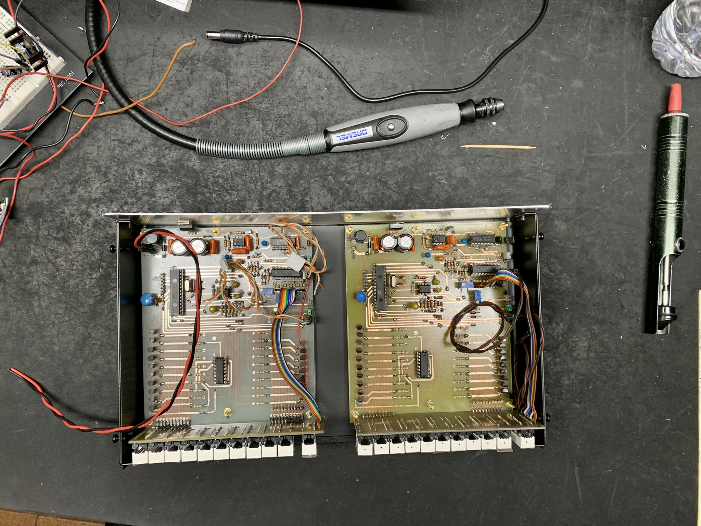
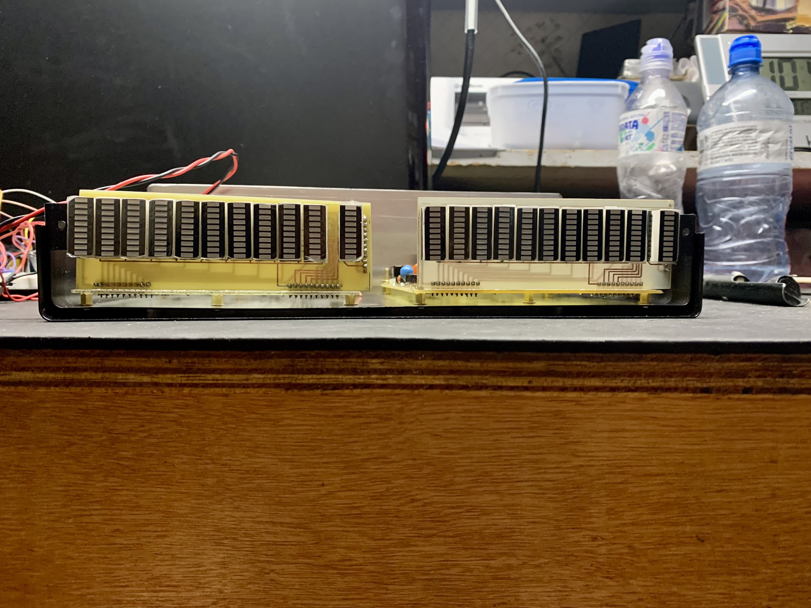
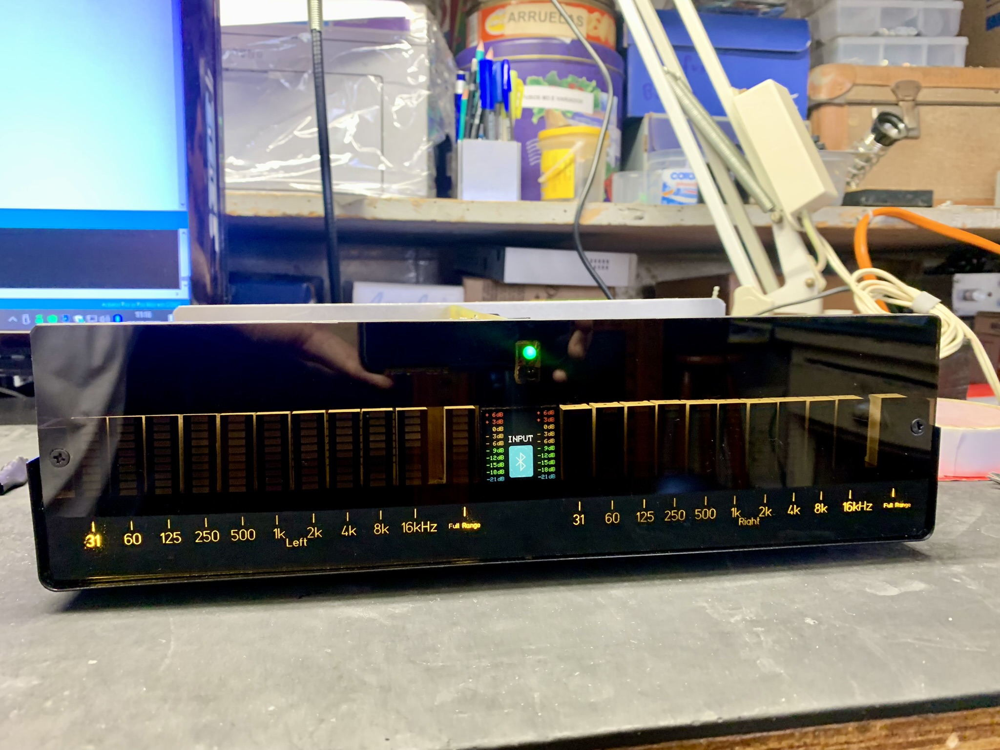
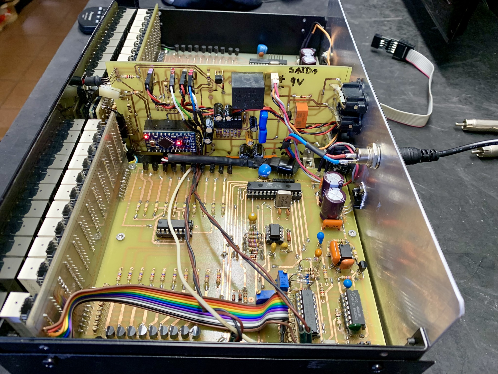
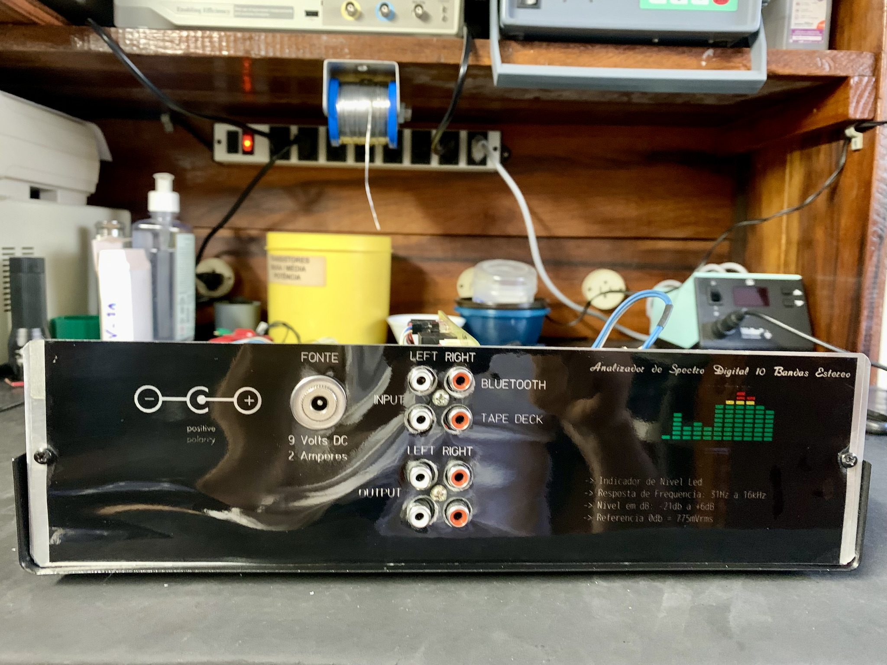

# AnalisadorDeEspectro-Atmega
# Stereo 10-Band Audio Spectrum Analyzer (Professional-Grade)

This is a professional-grade **10-band stereo audio spectrum analyzer**.
It analyzes audio signals and displays their intensity in dB on a LED bar display.
The system has been carefully calibrated with precision equipment to ensure maximum accuracy.

---

## Features

- Displays audio spectrum in **bar graph** or **dot mode**
- **Peak mode** for tracking signal peaks
- Two switchable audio inputs
- **IR remote control**:
  - Power on/off
  - Switch between inputs
  - Change LED display visual effects

---

## Hardware

- Microcontroller: ATmega
- LED bar display
- Audio inputs: 2, switchable
- Remote control: IR receiver
- Precision calibration used during setup

---

## Media

https://github.com/user-attachments/assets/92ead28e-b9d8-41bb-8769-a254721274eb

---

## Notes

- Source code is **not publicly available**
- Designed for **precision audio spectrum analysis**

